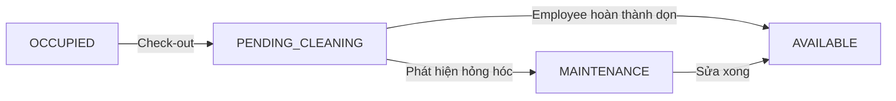

# 🔍 Phân tích mở rộng Role System — Góc nhìn Senior BA & Dev

## Tóm tắt yêu cầu giảng viên

| Yêu cầu | Mô tả |
|----------|--------|
| Thêm role **Admin** | Quyền hạn cao nhất, quản lý Manager |
| Thay đổi role **Manager** | Chỉ quản lý property được **phân công** (không phải toàn bộ hệ thống) |
| Thêm role **Employee** | Nhân viên property, được assign bởi Admin/Manager |
| Quy trình dọn phòng | Employee dọn phòng → cập nhật trạng thái Available |
| Room status mới | Thêm trạng thái **Pending Cleaning** sau check-out |

---

## 1. 📊 Gap Analysis — Hiện trạng vs Yêu cầu mới

### Hệ thống hiện tại (Specification_v2)

```
Roles: Guest → Customer → Manager (god-mode, quản lý mọi thứ)
```

- **Manager hiện tại = Admin + Landlord gộp lại** (line 63 spec): quản lý property, booking, customer, system settings, complaints, promotions — tất cả.
- **Không có cơ chế phân quyền theo property** — Manager thấy mọi property.
- **Không có Employee** — không có concept housekeeping.
- **Room status sau check-out** → trở về `AVAILABLE` ngay lập tức (không thực tế).

### Yêu cầu mới

```
Roles: Guest → Customer → Employee → Manager → Admin
                                 ↑              ↑
                            Scoped by       Scoped by
                            Property        Property
```

---

## 2. 🏗️ Đề xuất thay đổi chi tiết

### 2.1 Role Hierarchy & Permission Matrix

#### Role Enum mới

```
ADMIN → MANAGER → EMPLOYEE → CUSTOMER → GUEST
```

| Khả năng | Admin | Manager | Employee | Customer | Guest |
|----------|-------|---------|----------|----------|-------|
| Quản lý Manager (CRUD, assign property) | ✅ | ❌ | ❌ | ❌ | ❌ |
| Quản lý Employee (CRUD, assign property) | ✅ | ✅ (chỉ property mình) | ❌ | ❌ | ❌ |
| Quản lý Property (CRUD) | ✅ | ❌ (chỉ xem/sửa property được phân) | ❌ | ❌ | ❌ |
| Quản lý Floor/Room | ✅ | ✅ (property mình) | ❌ | ❌ | ❌ |
| Quản lý Booking | ✅ | ✅ (property mình) | ❌ | ✅ (booking mình) | ❌ |
| Check-in / Check-out | ✅ | ✅ | ❌ | ❌ | ❌ |
| Xem task dọn phòng | ✅ | ✅ | ✅ (property mình) | ❌ | ❌ |
| Cập nhật trạng thái dọn phòng | ❌ | ❌ | ✅ | ❌ | ❌ |
| Quản lý Customer (Active/Suspended) | ✅ | ✅ (customer của property mình) | ❌ | ❌ | ❌ |
| System Settings | ✅ | ❌ | ❌ | ❌ | ❌ |
| Promotions | ✅ | ✅ (property mình) | ❌ | ❌ | ❌ |
| Reports | ✅ (toàn hệ thống) | ✅ (property mình) | ❌ | ❌ | ❌ |
| Complaints | ✅ | ✅ (property mình) | ❌ | ✅ (tạo/xem) | ❌ |
| Review Moderation | ✅ | ✅ (property mình) | ❌ | ❌ | ❌ |
| Activity Log | ✅ | ✅ (property mình) | ❌ | ❌ | ❌ |

---

### 2.2 Data Model — Thay đổi cần thiết

#### ① User Entity — Mở rộng Role Enum

```diff
 public enum Role {
     CUSTOMER,
+    EMPLOYEE,
     MANAGER,
+    ADMIN
 }
```

#### ② [NEW] `PropertyAssignment` — Bảng phân công User ↔ Property

> [!IMPORTANT]
> Đây là entity **quan trọng nhất** cho yêu cầu mới. Nó quyết định Manager quản lý property nào, Employee thuộc property nào.

| Attribute | Type | Description |
|-----------|------|-------------|
| Id | UUID | Unique assignment identifier |
| UserId | UUID | FK → User (Manager hoặc Employee) |
| PropertyId | UUID | FK → Property |
| AssignedBy | UUID | FK → User (Admin hoặc Manager đã assign) |
| AssignedAt | DateTime | Thời điểm phân công |
| Status | Enum | ACTIVE, REVOKED |
| CreatedAt | DateTime | Creation date |
| UpdatedAt | DateTime | Last update date |

**Business rules:**
- 1 Manager có thể được assign **nhiều property**
- 1 Employee có thể được assign **1 hoặc nhiều property**
- Chỉ Admin mới assign Manager → Property
- Admin HOẶC Manager (của property đó) mới assign Employee → Property
- Khi revoke assignment, employee/manager mất quyền truy cập property đó

#### ③ [NEW] `CleaningTask` — Bảng quản lý công việc dọn phòng

> [!IMPORTANT]
> Entity này phục vụ yêu cầu **employee dọn phòng** và **tracking trạng thái phòng sau check-out**.

| Attribute | Type | Description |
|-----------|------|-------------|
| Id | UUID | Task identifier |
| RoomId | UUID | FK → Room cần dọn |
| BookingId | UUID | FK → Booking vừa check-out (nullable) |
| AssignedTo | UUID | FK → User (Employee được giao) |
| AssignedBy | UUID | FK → User (Manager hoặc hệ thống tự giao) |
| Status | Enum | PENDING, IN_PROGRESS, COMPLETED |
| Priority | Enum | LOW, NORMAL, HIGH, URGENT |
| Notes | Text | Ghi chú từ manager |
| CompletionNotes | Text | Ghi chú hoàn thành từ employee |
| StartedAt | DateTime | Thời điểm employee bắt đầu dọn |
| CompletedAt | DateTime | Thời điểm hoàn thành |
| CreatedAt | DateTime | Creation date |
| UpdatedAt | DateTime | Last update date |

**Business rules:**
- Tự động tạo khi Booking chuyển sang `CHECKED_OUT`
- Employee chỉ thấy task của property mình được assign
- Khi employee đánh dấu `COMPLETED` → Room status tự động chuyển về `AVAILABLE`
- Manager có thể reassign task cho employee khác

#### ④ Room Status — Thêm trạng thái `PENDING_CLEANING`

```diff
 public enum Status {
     AVAILABLE,
     PENDING_DEPOSIT,
     RESERVED,
     OCCUPIED,
+    PENDING_CLEANING,   // Khách vừa check-out, chờ dọn
     MAINTENANCE
 }
```

**Flow mới sau check-out:**



> [!NOTE]
> Spec hiện tại ghi "pending hoặc maintain" — tôi đề xuất dùng `PENDING_CLEANING` thay vì `PENDING` để tránh nhầm lẫn với `PENDING_DEPOSIT` đã có. `MAINTENANCE` giữ nguyên cho trường hợp phòng bị hỏng.

#### ⑤ Property Entity — Thêm relationship

```diff
 // Danh sách nhân sự (Manager/Employee) được assign
+@OneToMany(mappedBy = "property")
+private List<PropertyAssignment> assignments;
```

---

### 2.3 Functional Requirements — Cần thêm/sửa

#### [NEW] FR-20 Admin Management

* Admin quản lý danh sách Manager (CRUD).
* Admin tạo tài khoản Manager mới (hoặc nâng cấp Customer → Manager).
* Admin phân công Manager quản lý một hoặc nhiều property (`PropertyAssignment`).
* Admin thu hồi quyền quản lý property của Manager.
* Admin xem dashboard tổng hệ thống: tổng property, tổng manager, tổng employee, tổng booking, doanh thu toàn hệ thống.
* Admin quản lý System Settings (chuyển từ Manager hiện tại).
* Admin quản lý tài khoản tất cả user (Active/Suspended) — phạm vi toàn hệ thống.

#### [NEW] FR-21 Employee Management

* Admin hoặc Manager (của property) quản lý danh sách Employee.
* Tạo tài khoản Employee mới hoặc assign user có sẵn làm Employee cho property.
* Assign/Revoke Employee khỏi property.
* Xem danh sách Employee theo property.

#### [NEW] FR-22 Housekeeping / Cleaning Task Management

* Khi Booking chuyển sang `CHECKED_OUT`, hệ thống tự động:
  - Chuyển Room status → `PENDING_CLEANING`
  - Tạo `CleaningTask` với status = `PENDING`
* Manager có thể assign task cho Employee cụ thể hoặc để hệ thống auto-assign (round-robin theo employee available).
* Employee xem danh sách task được giao (filter theo property).
* Employee cập nhật trạng thái:
  - `PENDING` → `IN_PROGRESS` (bắt đầu dọn)
  - `IN_PROGRESS` → `COMPLETED` (dọn xong)
* Khi task = `COMPLETED`:
  - Room status tự động → `AVAILABLE`
  - Notification gửi cho Manager
* Nếu Employee phát hiện hỏng hóc:
  - Có thể tạo Maintenance Ticket
  - Room status → `MAINTENANCE` (thay vì AVAILABLE)

#### [MODIFY] FR-04 Booking — Cập nhật flow check-out

```diff
 * Manager thực hiện quy trình Check-in và Check-out
-  để cập nhật trạng thái thực tế của Booking và phòng.
+  để cập nhật trạng thái thực tế của Booking.
+  Khi Check-out, phòng chuyển sang PENDING_CLEANING (thay vì AVAILABLE).
+  Phòng chỉ trở về AVAILABLE sau khi Employee hoàn thành dọn phòng.
```

#### [MODIFY] FR-06 Property Management — Phân quyền

```diff
-* Tạo property mới (homestay/resort).
+* Admin tạo property mới và assign Manager quản lý.
+* Manager chỉ xem/sửa property được phân công.
 * Chỉnh sửa thông tin property.
 * Xem danh sách và chi tiết property.
```

#### [MODIFY] FR-09 Customer Management — Phân quyền

```diff
-* Xem danh sách Customer với các bộ lọc và tìm kiếm.
+* Admin xem tất cả Customer; Manager chỉ xem Customer có booking tại property mình.
```

#### [MODIFY] FR-17 Administration — Tách quyền

```diff
-* Quản lý tài khoản Customer.
+* Admin quản lý tất cả tài khoản.
+* Manager quản lý Customer trong scope property mình.
-* Cấu hình hệ thống (System Settings)
+* Chỉ Admin mới cấu hình System Settings.
```

---

### 2.4 Actors & Roles — Viết lại Section 2

#### Admin (NEW)

Quản trị viên hệ thống có quyền hạn cao nhất.

**Permissions**
* Quản lý toàn bộ Manager (tạo, sửa, vô hiệu hóa tài khoản).
* Phân công / thu hồi Manager cho Property.
* Tạo, sửa, xóa Property.
* Quản lý Employee trên toàn hệ thống.
* Quản lý tài khoản tất cả user (Active/Suspended).
* Cấu hình System Settings.
* Xem báo cáo toàn hệ thống.
* Quản lý khiếu nại toàn hệ thống.
* Theo dõi Activity Log toàn hệ thống.
* Quản lý Promotions.

#### Manager (MODIFIED)

Người quản lý property **được phân công**, không còn là god-mode.

**Permissions**
* Quản lý Floor/Room trong property được phân công.
* Quản lý Booking trong property được phân công.
* Check-in / Check-out.
* Xác nhận thanh toán cho booking thuộc property mình.
* Quản lý Contract thuộc property mình.
* Quản lý Employee thuộc property mình (assign/revoke/xem).
* Assign Cleaning Task cho Employee.
* Xem báo cáo và thống kê cho property mình.
* Quản lý và giải quyết khiếu nại liên quan property mình.
* Kiểm duyệt Review cho room thuộc property mình.
* Quản lý Promotion cho property mình.

#### Employee (NEW)

Nhân viên vận hành property, được assign bởi Admin hoặc Manager.

**Permissions**
* Xem danh sách Cleaning Task được giao.
* Cập nhật trạng thái dọn phòng (Pending → In Progress → Completed).
* Xem thông tin phòng trong property được assign.
* Tạo Maintenance Ticket khi phát hiện hỏng hóc trong quá trình dọn.
* Xem profile cá nhân.

---

### 2.5 Security — Cập nhật

```diff
-* Phân quyền theo vai trò (Guest, Customer, Manager)
+* Phân quyền theo vai trò (Guest, Customer, Employee, Manager, Admin)
+  với cơ chế property-scoped authorization cho Manager và Employee.
```

> [!WARNING]
> Đây là thay đổi **breaking** về security. Mọi API endpoint hiện tại chỉ check `role == MANAGER` cần được refactor thành check `role == ADMIN || (role == MANAGER && isAssignedTo(propertyId))`.

---

### 2.6 Error Handling — Thêm mới

#### Authorization Errors (NEW)

* Manager không được phân công property này.
* Employee không thuộc property này.
* Chỉ Admin mới có quyền thực hiện thao tác này.
* Chỉ Admin hoặc Manager của property mới quản lý Employee.
* Employee chưa được assign cleaning task này.

#### Cleaning Task Errors (NEW)

* Cleaning task đã được assign cho employee khác.
* Cleaning task đã hoàn thành, không thể cập nhật.
* Không tìm thấy cleaning task.
* Phòng chưa ở trạng thái PENDING_CLEANING.

---

### 2.7 Acceptance Criteria — Bổ sung

#### Admin Management (NEW)

* Admin có thể tạo/sửa/vô hiệu hóa tài khoản Manager.
* Admin có thể assign Manager cho property và thu hồi.
* Admin dashboard hiển thị KPIs toàn hệ thống.
* Admin quản lý System Settings thành công.

#### Employee Management (NEW)

* Admin/Manager có thể tạo và assign Employee cho property.
* Employee chỉ thấy data của property được assign.
* Employee bị revoke khỏi property mất quyền truy cập ngay lập tức.

#### Housekeeping (NEW)

* Khi check-out, Room status tự động → `PENDING_CLEANING`.
* Cleaning Task tự động tạo khi check-out.
* Employee cập nhật task → `COMPLETED`, Room tự động → `AVAILABLE`.
* Manager nhận notification khi dọn phòng hoàn thành.

#### Property-Scoped Authorization (NEW)

* Manager chỉ thấy và thao tác data thuộc property được phân công.
* Truy cập data ngoài scope bị từ chối với thông báo phù hợp.

---

## 3. 📐 Impact Assessment

### Backend Impact

| Component | Thay đổi | Mức độ |
|-----------|----------|--------|
| [User.java](file:///d:/Ky8/SWP391_G6/backend/src/main/java/com/homestay/entity/User.java) | Thêm `ADMIN`, `EMPLOYEE` vào Role enum | 🟡 Medium |
| [Room.java](file:///d:/Ky8/SWP391_G6/backend/src/main/java/com/homestay/entity/Room.java) | Thêm `PENDING_CLEANING` vào Status enum | 🟡 Medium |
| [Property.java](file:///d:/Ky8/SWP391_G6/backend/src/main/java/com/homestay/entity/Property.java) | Thêm relationship tới PropertyAssignment | 🟢 Low |
| **PropertyAssignment.java** [NEW] | Entity mới — bảng phân công | 🔴 High |
| **CleaningTask.java** [NEW] | Entity mới — quản lý dọn phòng | 🔴 High |
| **Security Layer** | Refactor toàn bộ authorization logic | 🔴 High |
| **All Controller/Service** | Thêm property-scoped filter | 🔴 High |

### Frontend Impact

| Component | Thay đổi | Mức độ |
|-----------|----------|--------|
| Route/Layout | Thêm Admin layout, Employee layout | 🔴 High |
| Manager pages | Filter data theo property assignment | 🟡 Medium |
| [NEW] Admin pages | Dashboard, Manager CRUD, Property assign | 🔴 High |
| [NEW] Employee pages | Cleaning task list, update status | 🟡 Medium |
| Booking flow | Update check-out → PENDING_CLEANING | 🟢 Low |

### Database Migration

```sql
-- 1. Thêm role mới vào User
ALTER TABLE users ALTER COLUMN role TYPE VARCHAR(20);
-- Có thể INSERT admin account mặc định

-- 2. Tạo bảng property_assignments
CREATE TABLE property_assignments (
    id UUID PRIMARY KEY,
    user_id UUID NOT NULL REFERENCES users(id),
    property_id UUID NOT NULL REFERENCES properties(id),
    assigned_by UUID REFERENCES users(id),
    status VARCHAR(20) NOT NULL DEFAULT 'ACTIVE',
    assigned_at TIMESTAMP NOT NULL DEFAULT NOW(),
    created_at TIMESTAMP NOT NULL DEFAULT NOW(),
    updated_at TIMESTAMP NOT NULL DEFAULT NOW(),
    UNIQUE(user_id, property_id)
);

-- 3. Tạo bảng cleaning_tasks
CREATE TABLE cleaning_tasks (
    id UUID PRIMARY KEY,
    room_id UUID NOT NULL REFERENCES rooms(id),
    booking_id UUID REFERENCES bookings(id),
    assigned_to UUID REFERENCES users(id),
    assigned_by UUID REFERENCES users(id),
    status VARCHAR(20) NOT NULL DEFAULT 'PENDING',
    priority VARCHAR(10) DEFAULT 'NORMAL',
    notes TEXT,
    completion_notes TEXT,
    started_at TIMESTAMP,
    completed_at TIMESTAMP,
    created_at TIMESTAMP NOT NULL DEFAULT NOW(),
    updated_at TIMESTAMP NOT NULL DEFAULT NOW()
);

-- 4. Update Room status enum (thêm PENDING_CLEANING)
-- PostgreSQL enum handling...
```

---

## 4. 💡 Đề xuất bổ sung từ góc nhìn Senior BA/Dev

> [!TIP]
> Ngoài yêu cầu cốt lõi từ giảng viên, sau đây là những thứ **nên thêm** để hệ thống hoàn chỉnh và chuyên nghiệp hơn.

### 4.1 Admin Dashboard riêng biệt

Admin cần dashboard khác Manager:
- Tổng quan toàn hệ thống: tổng property, manager, employee, customer
- Revenue tổng hợp across all properties
- Manager performance (property nào doanh thu cao/thấp)
- System health overview

### 4.2 Employee Dashboard

- Danh sách task hôm nay (Today's Tasks)
- Quick stats: tasks completed, pending, avg cleaning time
- Nút "Start Cleaning" / "Complete" nhanh

### 4.3 Audit Trail cho PropertyAssignment

Khi Admin assign/revoke Manager hoặc Employee:
- Ghi log vào `ActivityLog` hiện có
- Gửi notification cho user bị thay đổi
- Email thông báo cho user bị revoke

### 4.4 Auto-assign Cleaning Task (Optional/Nice-to-have)

Manager có thể bật auto-assign mode:
- Round-robin cho employee available trong property
- Hoặc assign theo floor (employee phụ trách floor cụ thể)

### 4.5 Cleaning Performance Metrics (Nice-to-have)

- Thời gian dọn trung bình per employee
- Số phòng dọn/ngày
- Report cho Manager đánh giá hiệu suất

### 4.6 Property Data Isolation

> [!CAUTION]
> Đây là concern lớn nhất khi chuyển từ single-tenant (Manager god-mode) sang multi-tenant (property-scoped). Cần đảm bảo:
> - Manager A **không thể** thấy booking/revenue của property thuộc Manager B
> - Employee chỉ thấy task của property mình
> - API phải có middleware/interceptor check property scope trước khi trả data

### 4.7 Seeding Admin Account

- Hệ thống cần seed 1 admin account mặc định khi deploy
- Admin là tài khoản đặc biệt, **không đăng ký được qua UI**
- Chỉ Admin hiện tại mới tạo được Admin mới (nếu cần)

---

## 5. 🚦 Ưu tiên triển khai (Recommendation)

| Phase | Nội dung | Effort |
|-------|----------|--------|
| **Phase 1** | Thêm Role enum (ADMIN, EMPLOYEE), tạo PropertyAssignment entity, seed Admin | 2-3 ngày |
| **Phase 2** | Refactor security layer → property-scoped authorization | 3-4 ngày |
| **Phase 3** | Admin pages (Dashboard, Manager CRUD, Property assign) | 3-4 ngày |
| **Phase 4** | Employee entity, assign Employee, CleaningTask entity | 2-3 ngày |
| **Phase 5** | Housekeeping flow (auto-create task, employee update, room status) | 3-4 ngày |
| **Phase 6** | Employee pages (Task list, update status, dashboard) | 2-3 ngày |
| **Phase 7** | Testing, bug fix, polish | 2-3 ngày |
| **Tổng** | | **~17-24 ngày** |

---

## 6. ⚠️ Rủi ro & Lưu ý

> [!WARNING]
> **Breaking changes cho codebase hiện tại:**
> - Mọi API Manager hiện tại **không filter theo property** → cần refactor toàn bộ
> - Frontend Manager layout cần thêm property selector (nếu manager quản lý nhiều property)
> - Data migration: Manager hiện tại cần được assign property thủ công bởi Admin

> [!CAUTION]
> **Không nên bỏ qua:**
> - Property-scoped authorization phải implement ở **backend** (không chỉ frontend hide UI)
> - Cleaning task lifecycle phải **atomic** — room status và task status phải update cùng transaction
> - Admin account seed phải có password mạnh và force change on first login
